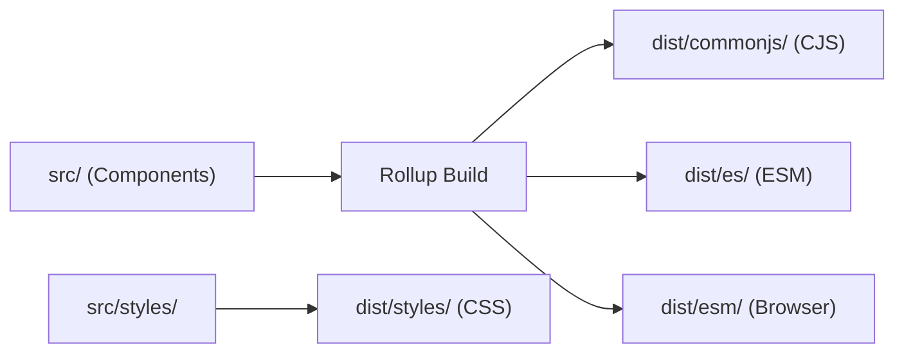

<!-- Logo -->
<p align="center">
  <a href="https://react.semantic-ui.com">
    
  </a>
</p>

<!-- Name -->
<h1 align="center">
  <a href="https://react.semantic-ui.com/">Semantic UI React</a>
</h1>

<!-- Badges -->
<p align="center">
  <a href="https://www.npmjs.com/package/semantic-ui-react">
    
  </a>
  <a href="https://www.npmjs.com/package/semantic-ui-react">
    
  </a>
  <a href="https://github.com/Semantic-Org/Semantic-UI-React/blob/master/LICENSE.md">
    
  </a>
</p>

The official React component library for [Semantic UI](https://semantic-ui.com/), with built-in CSS, theming, and React 19 support.

## Requirements

- **React** 19.0.0 or later
- **Node.js** 20 or later (for development)
- **Browser**: Chrome 92+, Firefox 90+, Safari 15.4+, Edge 92+

## Installation

```bash
npm install semantic-ui-react react react-dom
```

## CSS Setup

Semantic UI React v4 ships its own CSS. No `semantic-ui-css` package needed.

### Full CSS (simplest)

```js
import 'semantic-ui-react/styles'
```

### Per-component CSS (recommended for smaller bundles)

```js
import 'semantic-ui-react/styles/elements/button.css'
import 'semantic-ui-react/styles/collections/form.css'
```

## Quick Start

```jsx
import { Button } from 'semantic-ui-react'
import 'semantic-ui-react/styles'

function App() {
  return <Button primary>Click Me</Button>
}
```

## Features

- **50+ Components**: Buttons, forms, modals, dropdowns, tables, and more
- **React 19 Native**: ref-as-prop, form actions, React Compiler support
- **Built-in CSS**: No external CSS dependency, with per-component imports
- **Theming**: CSS custom properties for runtime theme switching
- **Dark Mode**: Built-in dark theme
- **TypeScript**: Written in TypeScript with full type safety
- **Accessible**: Built with ARIA attributes and keyboard navigation
- **Tree-Shakeable**: Import only what you use
- **Minimal Dependencies**: Only 6 runtime deps (`@floating-ui/react-dom`, `clsx`, `lodash`, `lodash-es`, `react-is`, `@babel/runtime`)

## Theming

```jsx
import { ThemeProvider } from 'semantic-ui-react'
import 'semantic-ui-react/styles/themes/dark.css'

function App() {
  return (
    <ThemeProvider theme='dark'>
      <YourApp />
    </ThemeProvider>
  )
}
```

## React 19 Form Actions

```jsx
import { Form, useFormAction } from 'semantic-ui-react'

async function submitAction(prevState, formData) {
  return { success: true }
}

function MyForm() {
  const [state, formAction, isPending] = useFormAction(submitAction, {})
  return (
    <Form action={formAction} loading={isPending}>
      <Form.Input name='email' label='Email' />
      <Form.Button type='submit'>Submit</Form.Button>
    </Form>
  )
}
```

## Architecture



Components are organized into five categories: **Addons**, **Collections**, **Elements**, **Modules**, and **Views**. Shared utilities live in `src/lib/` including className builders, component factories, hooks, and type definitions.

See [docs/engineering/implementation.md](docs/engineering/implementation.md) for the full architecture guide.

## Tech Stack

| Layer           | Technology                      | Version         |
| --------------- | ------------------------------- | --------------- |
| Language        | JavaScript + TypeScript         | ES2021 / TS 5.9 |
| Framework       | React                           | 19.x            |
| Build           | Rollup                          | 4.x             |
| Tests           | Vitest + React Testing Library  | 3.x / 16.x      |
| Lint            | ESLint (flat config) + Prettier | 9.x / 3.x       |
| Docs            | Astro                           | —               |
| Package Manager | Yarn (Berry)                    | 4.6.0           |
| CI              | GitHub Actions                  | Node 20         |

## Migration from v3

See [MIGRATION.md](./MIGRATION.md) for detailed upgrade instructions.

## Testing

```bash
yarn test            # Watch mode
yarn test -- --run   # Single run (CI)
yarn test -- --run --coverage  # With coverage
```

Coverage threshold: **80% patch** (new code), monitored via Codecov. See [docs/engineering/testing.md](docs/engineering/testing.md) and [docs/engineering/coverage.md](docs/engineering/coverage.md).

## Documentation

**Live Docs**: [react.semantic-ui.com](https://react.semantic-ui.com) — Full API reference, examples, and guides.

### Engineering Documentation

| Document                                               | Description                         |
| ------------------------------------------------------ | ----------------------------------- |
| [Install](docs/engineering/install.md)                 | Prerequisites and installation      |
| [Setup](docs/engineering/setup.md)                     | Environment configuration           |
| [First Run](docs/engineering/first-run.md)             | Clone-to-running golden path        |
| [Functionality](docs/engineering/functionality.md)     | Component categories and features   |
| [Schema](docs/engineering/schema.md)                   | TypeScript type system              |
| [API](docs/engineering/api.md)                         | Component API conventions and hooks |
| [Implementation](docs/engineering/implementation.md)   | Architecture and build pipeline     |
| [Integrations](docs/engineering/integrations.md)       | Dependencies and tooling            |
| [Testing](docs/engineering/testing.md)                 | Test strategy and patterns          |
| [Coverage](docs/engineering/coverage.md)               | Coverage tools and thresholds       |
| [Troubleshooting](docs/engineering/troubleshooting.md) | Common issues and debugging         |
| [Security](docs/engineering/security.md)               | Dependency and coding safety        |
| [Contributing](docs/engineering/contributing.md)       | PR workflow and code style          |
| [Changelog](docs/engineering/changelog.md)             | Release history                     |

## Contributing

See [CONTRIBUTING.md](.github/CONTRIBUTING.md) for development setup and contribution guidelines.

## License

[MIT](LICENSE)
