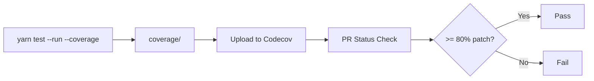

# Coverage

## Coverage Tools

| Tool        | Purpose                                    |
| ----------- | ------------------------------------------ |
| **Vitest**  | Test runner with built-in coverage support |
| **v8**      | Coverage provider (fast, native)           |
| **Codecov** | CI coverage reporting and PR checks        |

## Configuration

### Vitest Coverage (`vitest.config.mjs`)

```js
coverage: {
  provider: 'v8',
  include: ['src/**'],
  reporter: ['lcov', 'json', 'text'],
}
```

### Codecov Thresholds (`codecov.yml`)

| Metric      | Target            | Scope                   |
| ----------- | ----------------- | ----------------------- |
| **Project** | 2% drop tolerance | Overall codebase        |
| **Patch**   | 80%               | New/changed code in PRs |

### Ignored Paths

Coverage analysis ignores:

- `docs/**`
- `*.config.*`
- `**/dist/**`

## Generating Coverage Locally

```bash
# Run tests with coverage
yarn test -- --run --coverage

# Coverage reports are generated in:
# ./coverage/lcov-report/index.html   (HTML report)
# ./coverage/lcov.info                (LCOV)
# ./coverage/coverage-final.json      (JSON)
```

Open `coverage/lcov-report/index.html` in a browser to view the interactive report.

## Coverage Table

> Exact module-level coverage numbers are not available in the repository. Run `yarn test -- --run --coverage` to generate current numbers.

| Module             | Statements | Branches | Functions | Lines | Notes                              |
| ------------------ | ---------- | -------- | --------- | ----- | ---------------------------------- |
| `src/addons/`      | —          | —        | —         | —     | Generate locally                   |
| `src/collections/` | —          | —        | —         | —     | Generate locally                   |
| `src/elements/`    | —          | —        | —         | —     | Generate locally                   |
| `src/modules/`     | —          | —        | —         | —     | Dropdown, Modal, Popup are complex |
| `src/views/`       | —          | —        | —         | —     | Generate locally                   |
| `src/lib/`         | —          | —        | —         | —     | Utility functions                  |

### Recommended Target Policy

| Metric                    | Minimum                   | Target          |
| ------------------------- | ------------------------- | --------------- |
| Patch coverage (new code) | **80%**                   | 90%             |
| Overall project           | Maintain current baseline | Do not decrease |

## CI Coverage Workflow



## Known Gaps

- **Dropdown**: Most complex component; edge cases around keyboard navigation and search may lack full branch coverage
- **Modal/Popup**: Portal-based rendering with scroll locking needs careful DOM interaction testing
- **Transition**: Animation timing tests are inherently flaky; some branches may be intentionally under-tested
