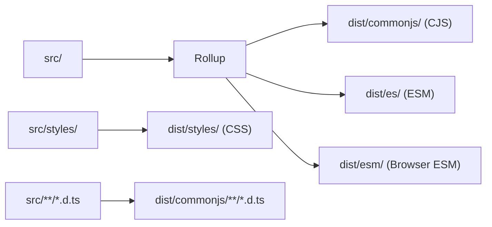
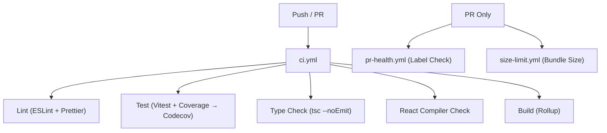

# Implementation

## Repository Layout

```
Semantic-UI-React/
├── src/                          # Component source code
│   ├── index.js                  # Barrel export (all components)
│   ├── generic.d.ts              # Shared TypeScript types
│   ├── addons/                   # Utility components (Confirm, Portal, ThemeProvider, etc.)
│   ├── collections/              # Compound components (Form, Grid, Menu, Table, etc.)
│   ├── elements/                 # Basic UI blocks (Button, Icon, Input, Label, etc.)
│   ├── modules/                  # Interactive components (Dropdown, Modal, Popup, etc.)
│   ├── views/                    # Data display (Card, Comment, Feed, Item, Statistic)
│   ├── lib/                      # Shared utilities
│   │   ├── classNameBuilders.js  # Semantic UI className construction helpers
│   │   ├── factories.js          # Component factory functions (shorthand rendering)
│   │   ├── getUnhandledProps.js   # Extract non-component props for spreading
│   │   ├── getComponentType.js    # Determine element type for `as` prop
│   │   ├── htmlInputAttrs.js      # Valid HTML input attributes
│   │   ├── shallowEqual.js        # Shallow comparison utility
│   │   ├── doesNodeContainClick.js # Click containment detection
│   │   ├── childrenUtils.js       # Children inspection utilities
│   │   └── hooks/                 # React hooks (11 hooks)
│   └── styles/                   # Built-in CSS
│       ├── index.css             # Main stylesheet
│       └── themes/               # Theme CSS files
├── dist/                         # Build outputs
│   ├── commonjs/                 # CJS modules
│   ├── es/                       # ESM modules
│   ├── esm/                      # Browser ESM bundle
│   └── styles/                   # CSS distribution
├── test/                         # Test suite
│   ├── specs/                    # Unit tests (mirrors src/ structure)
│   ├── utils/                    # Test utilities
│   └── setup.js                  # Test bootstrap (console override, RTL matchers)
├── docs/                         # Astro documentation site
├── scripts/                      # Build and maintenance scripts
└── index.d.ts                    # Public TypeScript declarations
```

## Build Pipeline



### Build Configuration (`rollup.config.mjs`)

| Output                              | Format            | Target                  | Externals                           |
| ----------------------------------- | ----------------- | ----------------------- | ----------------------------------- |
| `dist/commonjs/`                    | CommonJS          | Node/bundlers           | All deps external                   |
| `dist/es/`                          | ES Modules        | Bundlers (tree-shaking) | All deps external, lodash→lodash-es |
| `dist/esm/semantic-ui-react.esm.js` | ESM (single file) | CDN/browsers            | All deps external, lodash→lodash-es |

### External Dependencies (Never Bundled)

```
react, react-dom, react/jsx-runtime, react-is,
@floating-ui/react-dom, clsx, lodash, lodash-es, debug, @babel/runtime
```

## Component Architecture

### Standard Component Pattern

```jsx
import { forwardRef } from 'react'
import clsx from 'clsx'
import { getComponentType, getUnhandledProps, useKeyOnly } from '../../lib'

const Button = (props) => {
  const { active, as, children, className, disabled, ref, ...rest } = props
  const ElementType = getComponentType(props, { defaultAs: 'button' })
  const unhandledProps = getUnhandledProps(Button, props)

  const classes = clsx(
    'ui',
    useKeyOnly(active, 'active'),
    useKeyOnly(disabled, 'disabled'),
    'button',
    className,
  )

  return (
    <ElementType {...unhandledProps} className={classes} ref={ref}>
      {children}
    </ElementType>
  )
}

Button.displayName = 'Button'
Button.Content = ButtonContent
Button.Group = ButtonGroup
Button.Or = ButtonOr

export default Button
```

### Key Patterns

1. **No class components**: All function components
2. **`displayName` required**: Static property on every component
3. **Sub-components as statics**: `Parent.Child` pattern
4. **`as` prop**: Polymorphic rendering via `getComponentType()`
5. **className**: Built with `clsx` + Semantic UI helpers
6. **Unhandled props**: Spread via `getUnhandledProps()` for HTML passthrough
7. **ref-as-prop**: Destructured from props, not `forwardRef`

## CI Pipeline



### CI Jobs

| Job            | Command                         | Node Version |
| -------------- | ------------------------------- | ------------ |
| Lint           | `yarn lint`                     | 20           |
| Test           | `yarn test -- --run --coverage` | 20           |
| Type Check     | `yarn typecheck`                | 20           |
| React Compiler | `yarn lint` (compiler rules)    | 20           |
| Build          | `yarn build`                    | 20           |
