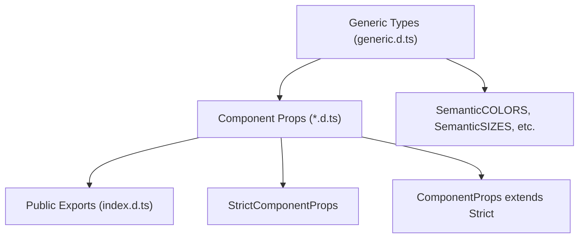

# Schema — Type System

Semantic UI React is a frontend UI library with no database. This document covers the **TypeScript type system** that serves as the project's schema.

## Type Definition Files

| File               | Purpose                                                    |
| ------------------ | ---------------------------------------------------------- |
| `src/generic.d.ts` | Shared type aliases, utility types, icon/color/size enums  |
| `index.d.ts`       | Public API type exports (re-exports from `dist/commonjs/`) |
| `src/**/*.d.ts`    | Per-component TypeScript interfaces                        |

## Core Types

### Utility Types

```typescript
type ForwardRefComponent<P, T> = React.FunctionComponent<P & React.RefAttributes<T>>
```

### Alignment Types

| Type                         | Values                                         |
| ---------------------------- | ---------------------------------------------- |
| `SemanticFLOATS`             | `'left' \| 'right'`                            |
| `SemanticTEXTALIGNMENTS`     | `'left' \| 'center' \| 'right' \| 'justified'` |
| `SemanticVERTICALALIGNMENTS` | `'top' \| 'middle' \| 'bottom'`                |

### Styling Types

| Type                  | Description                                                                                               |
| --------------------- | --------------------------------------------------------------------------------------------------------- |
| `SemanticCOLORS`      | 13 named colors (red, orange, yellow, olive, green, teal, blue, violet, purple, pink, brown, grey, black) |
| `SemanticSIZES`       | 8 size values (mini, tiny, small, medium, large, big, huge, massive)                                      |
| `SemanticWIDTHS`      | 1-16 as numbers, strings, or words                                                                        |
| `SemanticTRANSITIONS` | Directional + static animation names                                                                      |
| `SemanticICONS`       | 700+ icon name literals                                                                                   |

### Shorthand Types

```typescript
type SemanticShorthandItem<TProps> =
  | React.ReactNode
  | SemanticShorthandItemFunc<TProps>
  | (Omit<TProps, 'children'> & { children?: ... })

type SemanticShorthandCollection<TProps> = SemanticShorthandItem<TProps>[]
type SemanticShorthandContent = React.ReactNode
```

## Component Props Pattern

Every component exports two interfaces:

```typescript
// Strict interface — only documented props
export interface StrictButtonProps {
  active?: boolean
  animated?: boolean | 'fade' | 'vertical'
  as?: React.ElementType
  // ...
}

// Extended interface — includes HTML attributes
export interface ButtonProps extends StrictButtonProps {
  [key: string]: any
}
```

### Type Relationships


